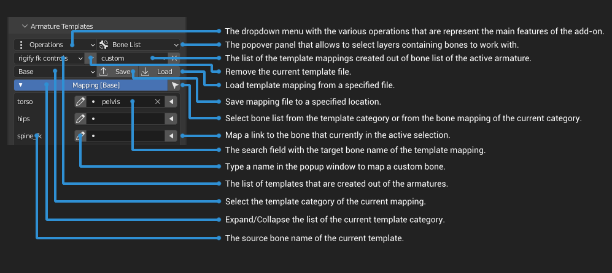

**"Armature Templates"** is an add-on for Blender that allows to manipulate skeleton with the help of various features depending on the predefined or custom template data. The main purpose of this add-on is to provide the possibility to export animated character rig to game engine or edit animation of the imported character from the game engine. The created template out of armature skeleton is a unified container of bone name list, which allows to make a particular mapping from the bone list of another skeleton as a link data and then perform some operations between those two armatures afterwards.

**Main Feature List:**

  - Templates
    - Create Template - Make a new json file as a template based on the naming convention of the active armature.
    - Edit Template - Edit the selected template and tweak the bone list depending on the active armature.
    - Guess Mapping - Search for bone names of the active armature and try to match them in the naming convention of the current template.
  - Rename Bones - Rename the active armature bones if they match in the template list.
  - Fit Meta-Rig - Choose the skeleton rig to align and to place the active armature bones, according to the template mapping.
  - Clean Imported Animation - Clear the transform keyframes to fix dislocated bones.
  - Constrain Armature - Choose a skeleton rig to constrain transformation of the active armature according to the template mapping.
  - Scale Skeleton - Parent the armature to the empty and then scale.

# Installation

- [**DOWNLOAD LATEST RELEASE**](https://github.com/tingjoybits/Armature_Templates/releases/latest/download/Armature_Templates.zip)<- file
- Open Blender and select Edit->Preferences
- Click Add-ons category and then 'Install...' button.
- Select the downloaded archive file from the link.
- Check the 'Armature Templates' option.

Video Course: https://tingjoybits.gumroad.com/l/eihgu

# Support the Developer:

**Gumroad**

https://tingjoybits.gumroad.com/l/tagplu

**Patreon**

https://www.patreon.com/tingjoybits
